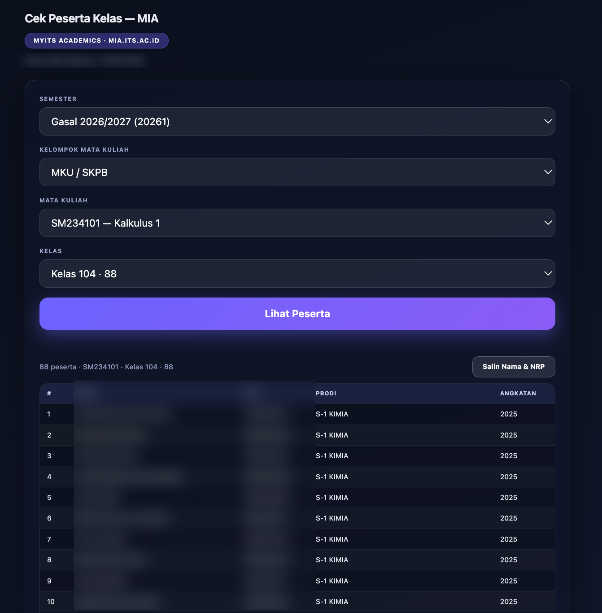

# Cek Peserta Kelas — ITS (MIA)

> Live: **https://cek-kelas-its.vercel.app** (halaman instruksi pasang ekstensi)

Ekstensi browser untuk melihat daftar peserta kelas di **myITS Academics (mia.its.ac.id)** —
pengganti SIAKAD ITS lama (`akademik.its.ac.id`).

## Tampilan



*Contoh tampilan di tab ekstensi. Nama pengguna & NRP peserta lain disamarkan untuk privasi.*

## Cara Kerja

- Seluruhnya **ekstensi browser** (Chrome/Edge/Brave). Tidak ada server perantara, tidak ada paste cookie, tidak ada DevTools.
- Ekstensi membaca sesi login MIA kamu di browser (cookie `httpOnly` hanya bisa dibaca ekstensi), lalu memanggil API MIA langsung.
- Buka MIA dan login satu kali; berikutnya tinggal klik ikon ekstensi.

## Cara Pasang

1. Download repo ini (`Code` → `Download ZIP`), ekstrak.
2. Buka `brave://extensions` (atau `chrome://extensions`), aktifkan **Developer mode**.
3. Klik **Load unpacked**, pilih folder `extension/`.
4. Ikon **Cek Peserta Kelas — MIA** muncul di toolbar.

## Cara Pakai

1. Klik ikon ekstensi → tab tool terbuka.
2. Kalau belum login MIA: klik **Login di myITS Academics**, login sekali di tab yang terbuka — sesi diambil otomatis.
3. Pilih **Semester → Mata Kuliah → Kelas**, klik **Lihat Peserta**.
4. Tabel peserta tampil (nama, NRP, prodi, angkatan) + tombol **Salin Nama & NRP**.

Saat sesi MIA kedaluwarsa, tool akan minta login ulang — sekali klik, sama seperti di atas.

## Struktur

```
index.html              — Landing sederhana + instruksi pasang
extension/manifest.json — MV3, izin cookies + host mia.its.ac.id
extension/background.js — Klik ikon → buka/fokus tab tool
extension/app.html      — Seluruh UI tool (HTML+CSS+JS inline)
```

## KS

- Landing (`index.html`) bisa di-hosting di mana saja (GitHub Pages cukup) — **tidak butuh server/serverless**.
- Ekstensi adalah tempat semua logika; website cuma instruksi.